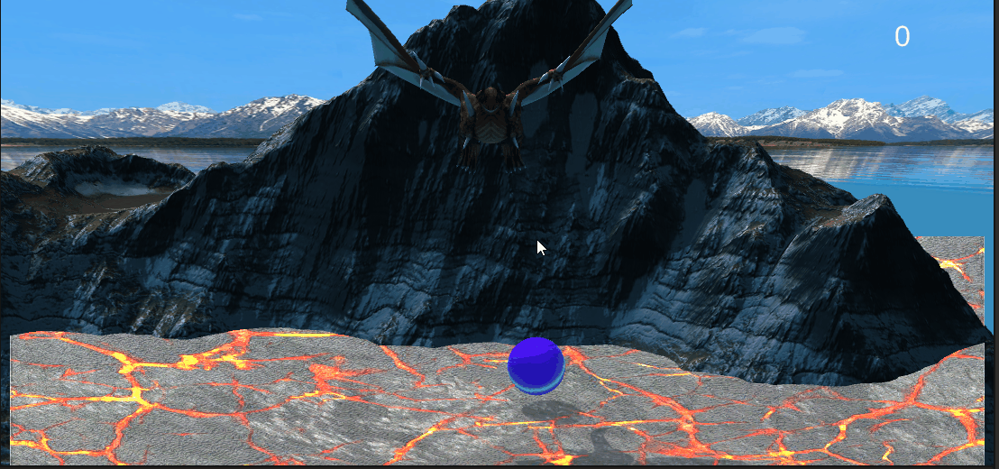
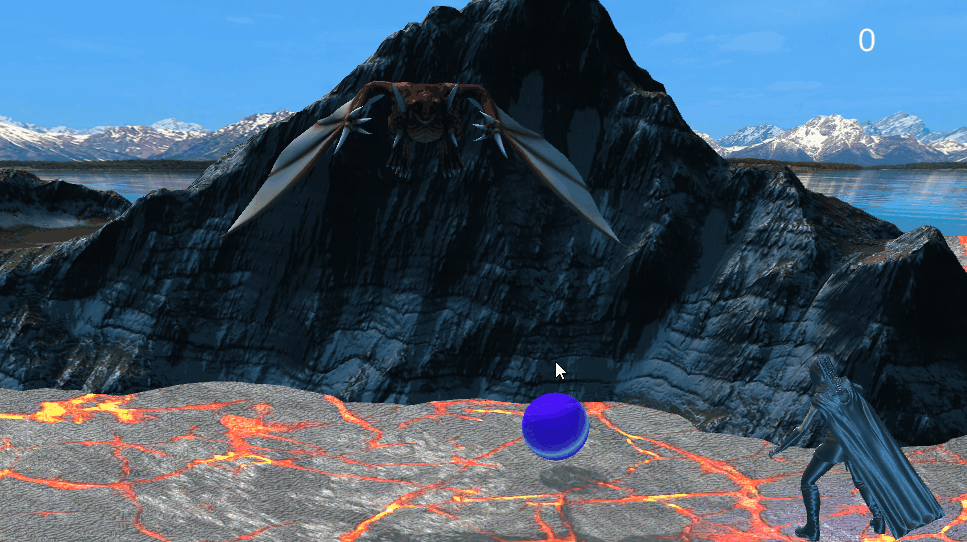

# РАЗРАБОТКА ИГРОВЫХ СЕРВИСОВ
Отчет по лабораторной работе #4 выполнил:
- Назаров Лев Сергеевич
- РИ300012

Отметка о выполнении заданий (заполняется студентом):

| Задание | Выполнение | Баллы |
| ------ | ------ | ------ |
| Задание 1 | * | 60 |
| Задание 2 | * | 20 |
| Задание 3 | * | 20 |

знак "*" - задание выполнено; знак "#" - задание не выполнено;

Работу проверили:
- к.т.н., доцент Денисов Д.В.
- к.э.н., доцент Панов М.А.
- ст. преп., Фадеев В.О.

## Цель работы
Подготовить разрабатываемое интерактивное приложение к сборке и публикации.

## Задание 1
### Используя видео-материалы практических работ 1-5 повторить реализацию приведенного ниже функционала:
– 1 Практическая работа «Создание анимации объектов на сцене».<br>
– 2 Практическая работа «Создание стартовой сцены и переключение между ними».<br>
– 3 Практическая работа «Доработка меню и функционала с остановкой игры».<br>
– 4 Практическая работа «Добавление звукового сопровождения в игре».<br>
– 5 Практическая работа «Добавление персонажа и сборка сцены для публикации на web-ресурсе».<br>

Ход работы:
#### Работа 1: «Создание анимации объектов на сцене»
1) Создать копию сцены _0Scene и переименовать её в _1Scene.
2) В сцене _0Scene удалить скрипты с камеры и дракона, а также убрать текст для очков.
3) Переместить дракона и гору чтобы хорошо выглядело для главного меню.
4) Добавить дракону idle анимацию.
5) Импортировать ассет пак с текстурой облака.
6) Добавить облако на сцену под канвас.
7) Создать для облака анимацию медленного движения влево-вправо.

#### Работа 2: «Создание стартовой сцены и переключение между ними»
1) Добавить на канвас текст с названием игры.
2) Создать объект и скрипт MainMenu в котором добавить функции PlayGame и Quit:
```cs
public class MainMenu : MonoBehaviour
{
    public void PlayGame()
    {
        SceneManager.LoadScene(SceneManager.GetActiveScene().buildIndex + 1);
    }

    public void QuitGame()
    {
        Application.Quit();
    }
}
```
3) Создать три кнопки для главного меню - Play, Options и Quit.
4) Привязать нажатие кнопок к соответствующим функциям MainMenu.

#### Работа 3: «Доработка меню и функционала с остановкой игры»
1) Создать заготовку для меню настроек.
2) Создать скрипт для паузы и возврата в меню:
```cs
public class Pause : MonoBehaviour
{
    private bool paused = false;
    public GameObject panel;
    private void Update()
    {
        if (Input.GetKeyDown(KeyCode.Space))
        {
            Toggle();
        }
        if (Input.GetKeyDown(KeyCode.Escape))
        {
            if (paused)
                Toggle();
            SceneManager.LoadScene(SceneManager.GetActiveScene().buildIndex - 1);
        }
    }
    public void Toggle()
    {
        paused = !paused;
        if (paused)
        {
            Time.timeScale = 0;
            panel.SetActive(true);
        }
        else
        {
            Time.timeScale = 1;
            panel.SetActive(false);
        }
    }
}
```
3) Добавить на канвас текст, появляющийся во время паузы.

#### Работа 4: «Добавление звукового сопровождения в игре»
1) Импортировать ассет пак с музыкой и добавить её на сцены.
2) Импортировать ассет пак с взрывами.
3) Привязать эффект взрыва к моменту падения яица на землю.
4) Привязать эффект падения гранаты к моменту попадания яица на щит.
#### Работа 5: «Добавление персонажа и сборка сцены для публикации на web-ресурсе»
1) Скачать модель и анимацию персонажа.
2) Добавить персонажа на сцену и дать ему анимацию.
3) Добавить свет рядом с персонажем.
4) Забилдить проект.

## Задание 2
### Привести описание того, как происходит сборка проекта проекта под другие платформы. Какие могут быть особенности? 
Чтобы собрать проект под другую платформу надо сменить конфигурацию на соответствующую платформу и запустить сборку.<br>
Особенности для некоторых платформ:<br>
#### Android
- Другое управление, придется переделывать ввод.
- Интерфейс скорее всего тоже придется менять.
- Слабое железо, будет необходима оптимизация.
#### Linux
- Другая файловая система, код ответственный за сохранения возможно придется менять.
- Другие правила организации структуры папок и мест хранения данных.
- Могут быть проблемы с работой на разных дистрибутивах.
- Могут возникнуть проблемы с драйверами для видеокарт.
- Некоторые ассеты могут перестать работать.
#### Консоли Playstation
- Изначально сборка недоступна, необходимо стать партнером с Sony и получить лицензию на разработку под PS.
## Задание 3
### Добавить в меню Option возможность изменения громкости (от 0 до 100%) фоновой музыки в игре.
1) Создать AudioMixer в ассетах.
2) Сделать в миксере группу Music.
3) Сделать у группы Music доступным значение Volume.
4) Поставить у всех AudioSource'ов соответствующий Output.
5) Создать в меню настроек слайдер для громкости музыки.
6) Создать скрипт для настроек:
```cs
public class Settings : MonoBehaviour
{
    public AudioMixer audioMixer;
    public Slider MusicSlider;
    public void MusicVolumeChanged()
    {
        audioMixer.SetFloat("MusicVolume", Mathf.Log10(MusicSlider.value) * 20);
    }
}
```
7) Прикрепить скрипт настроек к меню настроек.
8) Привязать OnValueChanged слайдера громкости к соответствующей функции.<br>
<br>
## Выводы
Научился:
- Делать простое меню
- Подключать звуки и музыку
- Настраивать громкость
- Импортировать модельки и анимации с mixamo
## Powered by

**BigDigital Team: Denisov | Fadeev | Panov**